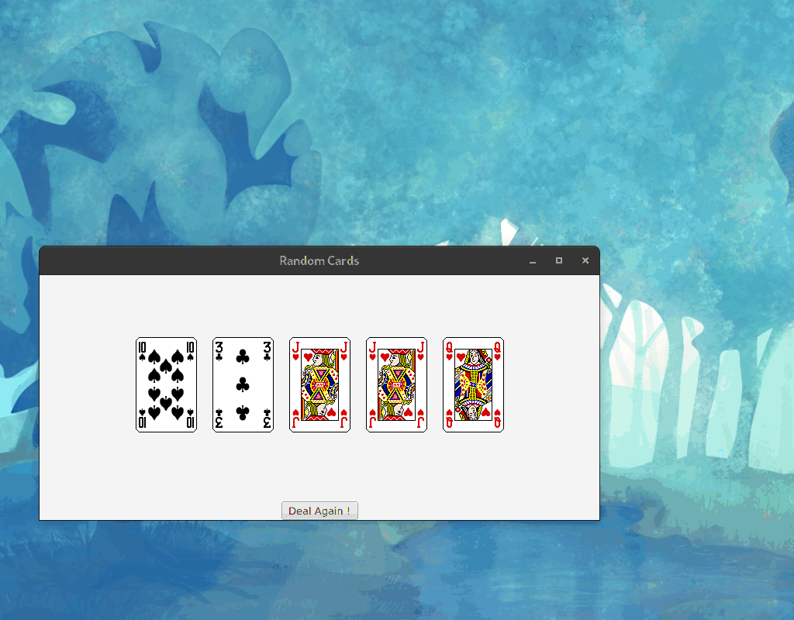
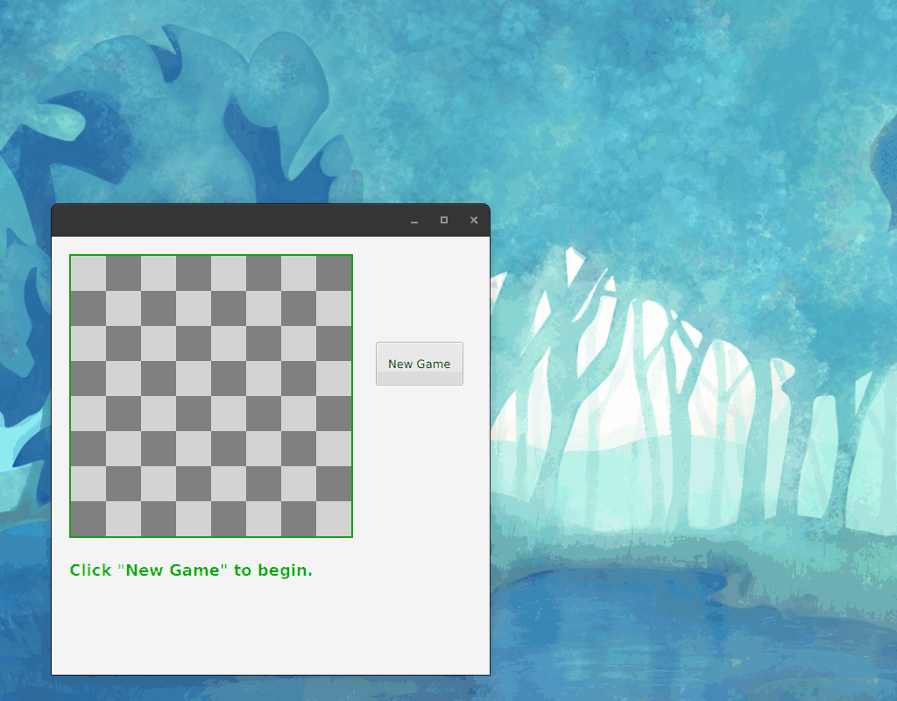

This repo contains my all example projects about JavaFX.

You can download it each repo independently and run it on your IDE. Or you can create fully jar by running the command `mvn clean install`. After running the mave command look at the folder called **shade** in that folder you can the JavaFX project with `java -jar {name}.jar`

### random-card-dealt

Get an random playing card from a deck.

### custom_pane_layout

Draw an basic checkerboard using Pane layout

